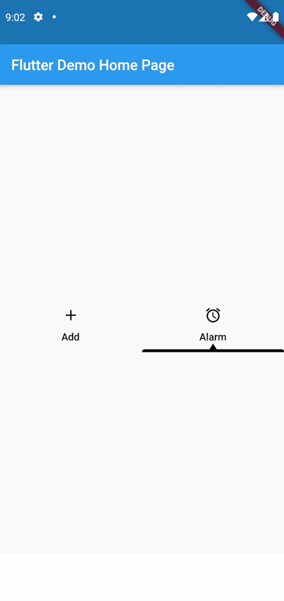

# custom_tabbar_indicator

A new Flutter package project for simple custom tabbar indicator

## Usage

To use this package, add custom_tabbar_indicator as a dependency in your pubspec.yaml file.
And add this import to your file.

import 'package:custom_tabbar_indicator/custom_tabbar_indicator.dart';

## Image

